<h3 align="center">Hi there 👋 I'm Kelvin, a software engineer from Hong Kong</h3> 

#### I speak ...
* C++
* Python

#### I'm interested in ...
* High-performance computing
* Heterogeneous computing (GPU/FPGA)
* Low latency programming techniques
* System performance optimization and measurement

